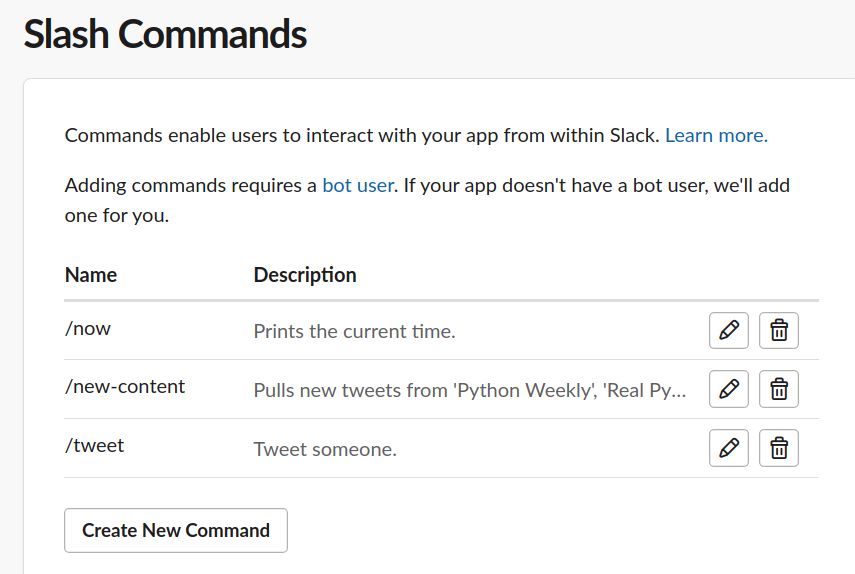
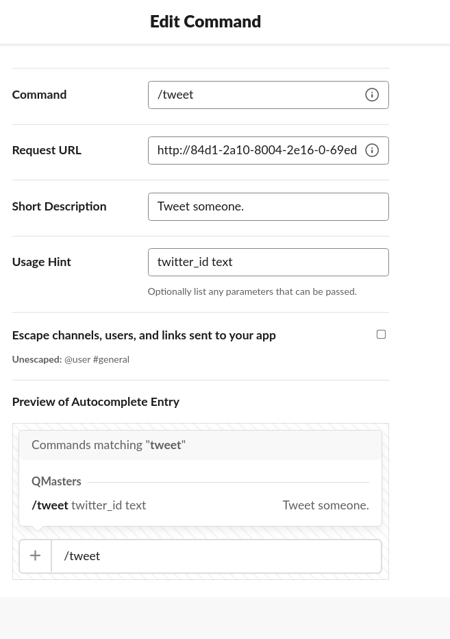
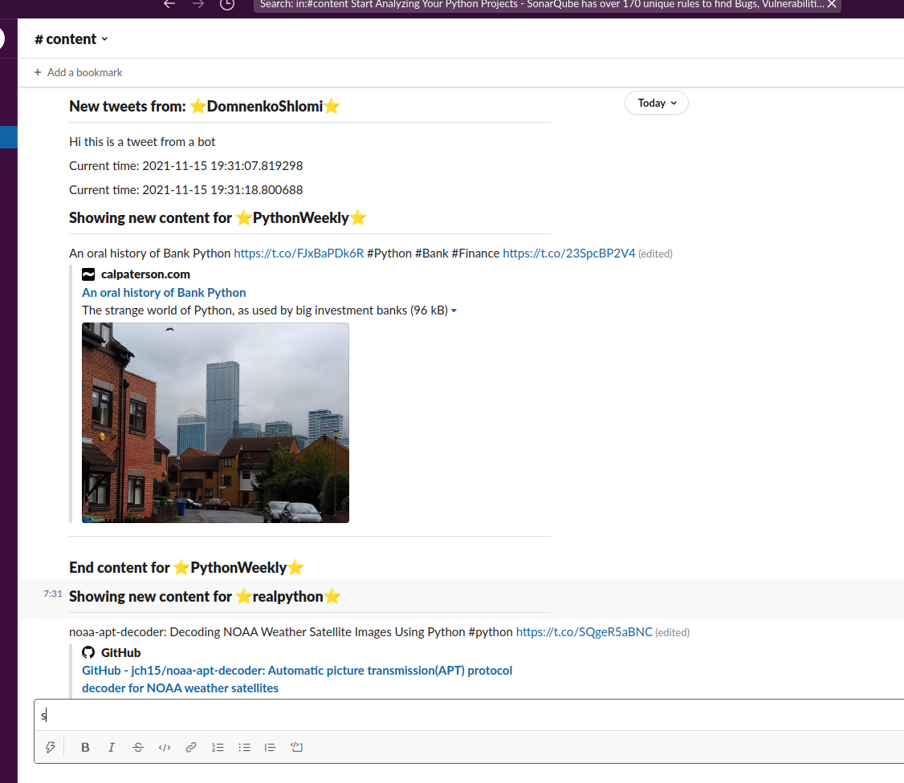
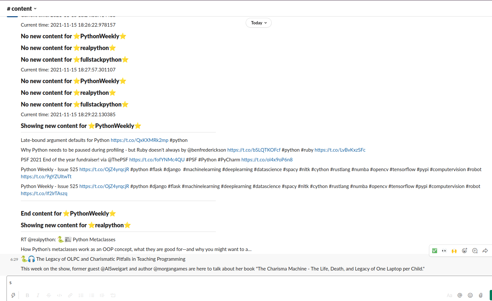
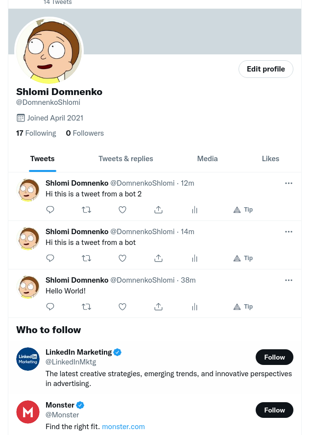

# QMasters-home-assignment

# Environment keys needed

* TWITTER_API_KEY
* TWITTER_API_KEY_SECRET
* TWITTER_BEARER_TOKEN
* TWITTER_ACCESS_TOKEN
* TWITTER_ACCESS_TOKEN_SECRET
* SLACK_TOKEN
* SLACK_BOT_USER_TOKEN

# Tools used

* Postman
* DBeaver
* PyCharm Professional
* Google
* ngrok - For public domain for testing

# Screenshots

